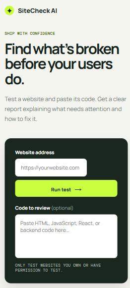

# 🚀 SiteCheck AI


<p align="center">
  <h3 align="center">Find what's broken before your users do.</h3>

  <p align="center">
    AI-powered website quality tester that analyzes websites and source code to detect bugs, performance issues, accessibility problems, SEO issues, and provides AI-generated fix suggestions.
  </p>
</p>

<p align="center">
  <a href="https://sitecheck-ai.onrender.com">
    
  </a>
</p>

<p align="center">
⭐ If you find this project useful, please consider giving it a star on GitHub!
</p>

---

# 🎥 Demo


---

# 📸 Homepage


---

# 📊 AI Analysis Report


---

# 📱 Mobile Experience



---

# ✨ Features

- 🌐 Analyze any public website in seconds
- 🤖 AI-powered website analysis using Gemini AI
- ⚡ Performance analysis and response time checks
- ♿ Accessibility validation
- 🔍 SEO analysis and recommendations
- 📝 Source code review
- 💡 AI-generated explanations and fix suggestions
- 📊 Overall Website Quality Score
- 📱 Fully responsive interface
- 🚀 Fast, lightweight, and easy to use

---

# 🛠️ Tech Stack

| Category | Technology |
|----------|------------|
| Frontend | HTML5, CSS3, JavaScript |
| Backend | Node.js |
| AI | Gemini API |
| Hosting | Render |
| Version Control | Git & GitHub |

---

# 🌐 Live Demo

🚀 **https://sitecheck-ai.onrender.com**

---

# ⚙️ Installation

Clone the repository

```bash
git clone https://github.com/ashif204-dev/sitecheck-ai.git
```

Go to the project

```bash
cd sitecheck-ai
```

Install dependencies

```bash
npm install
```

Run the project

```bash
npm start
```

Open your browser and visit

```text
http://localhost:3000
```

---

# 📈 Roadmap

### ✅ Current

- Website Analysis
- AI Code Review
- AI Fix Suggestions
- Website Quality Score
- Responsive Design
- Public Deployment

### 🚧 Coming Soon

- PDF Report Export
- Dashboard
- User Authentication
- Scan History
- Lighthouse Integration
- Playwright Browser Automation
- Broken Link Detection
- Image Validation
- Security Header Checks
- JavaScript Error Detection
- GitHub Repository Analysis

---

# 🤝 Contributing

Contributions, feature requests, and suggestions are welcome.

To contribute:

1. Fork this repository
2. Create your feature branch

```bash
git checkout -b feature/my-feature
```

3. Commit your changes

```bash
git commit -m "Add my feature"
```

4. Push your branch

```bash
git push origin feature/my-feature
```

5. Open a Pull Request

---

# 👨‍💻 Developer

**Ashif Hussain**

- GitHub: https://github.com/ashif204-dev
- Project: SiteCheck AI

---

# 📄 License

This project is licensed under the **MIT License**.

---

<p align="center">

Made with ❤️ by <b>Ashif Hussain</b>

⭐ Star this repository if you found it helpful!

</p>