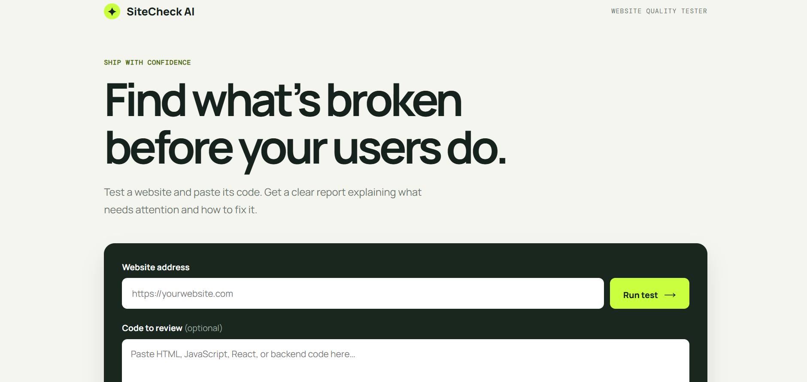
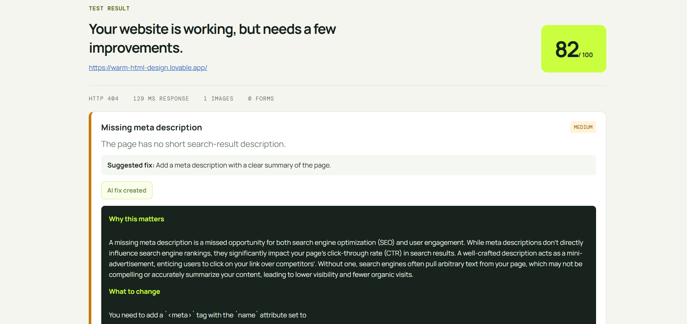

# 🚀 SiteCheck AI

AI-powered website quality tester that analyzes websites and source code to detect bugs, performance issues, accessibility problems, and provide AI-powered fix suggestions.

## 🌐 Live Demo

👉 https://sitecheck-ai.onrender.com

---

# 📸 Screenshots

## 🏠 Homepage



---

## 🤖 AI Analysis Report

The AI engine analyzes a website, detects quality issues, assigns a quality score, and generates detailed explanations with actionable fixes.



---

## ✨ Features

- 🌐 Website Quality Analysis
- 🤖 AI-Powered Issue Detection
- ⚡ Performance Checks
- ♿ Accessibility Audit
- 🔍 SEO Analysis
- 🧠 AI-generated explanations and fix suggestions
- 📊 Overall Quality Score
- 📝 Source Code Review using Gemini AI

---

## 🛠️ Tech Stack

- HTML5
- CSS3
- JavaScript (ES6+)
- Node.js
- Gemini API
- Render

---

## 🚀 Installation

```bash
git clone https://github.com/ashif204-dev/sitecheck-ai.git

cd sitecheck-ai

npm install

npm start
```

Open:

```
http://localhost:3000
```

---

## 📈 Roadmap

- [x] Website Analysis
- [x] AI-powered Fix Suggestions
- [x] Source Code Review
- [x] Live Deployment
- [ ] Lighthouse Integration
- [ ] PDF Report Export
- [ ] User Authentication
- [ ] Dashboard
- [ ] Scan History
- [ ] JavaScript-rendered Website Support

---

## 📄 License

MIT License